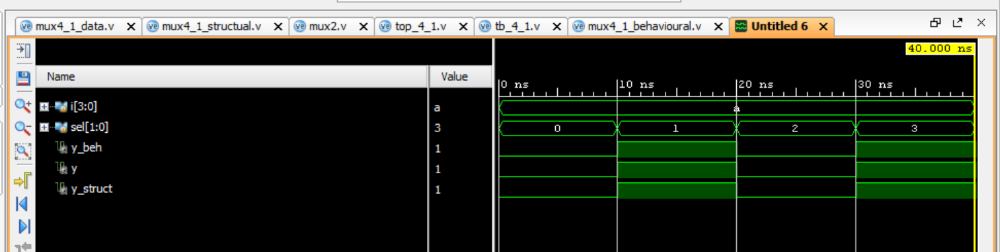

# 4:1 Multiplexer in Verilog

## 📌 Objective

Design and verify a 4:1 Multiplexer using different modeling styles in Verilog.

## 🧠 Modeling Styles

* Dataflow Modeling
* Behavioral Modeling
* Structural Modeling

## 🛠️ Tools Used

* Verilog HDL
* Xilinx Vivado Simulator

## 📂 Project Structure

* `src/` → Design files
* `tb/` → Testbench
* `sim/` → Simulation results

## ▶️ Simulation

A common testbench is used to verify all three implementations.
All outputs are compared and confirmed to be identical.

## 📊 Waveform

## ✅ Conclusion

All modeling styles produce the same functional output, demonstrating equivalence across abstraction levels in RTL design.

## 👨‍💻 Author

Koushik
